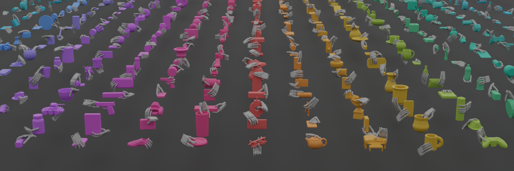
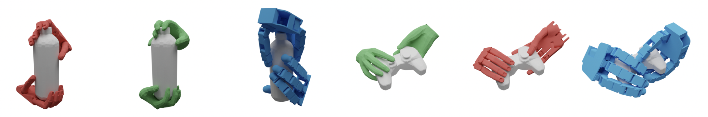

# DexGraspNet: A Large-Scale Robotic Dexterous Grasp Dataset for General Objects Based on Simulation

This is the official repository of [DexGraspNet: A Large-Scale Robotic Dexterous Grasp Dataset for General Objects Based on Simulation](https://arxiv.org/abs/2210.02697).

[[project page]](https://pku-epic.github.io/DexGraspNet/)

## Introduction



Robotic dexterous grasping is the first step to enable human-like dexterous object manipulation and thus a crucial robotic technology. However, dexterous grasping is much more under-explored than object grasping with parallel grippers, partially due to the lack of a large-scale dataset. In this work, we present a large-scale robotic dexterous grasp dataset, DexGraspNet, generated by our proposed highly efficient synthesis method that can be generally applied to any dexterous hand. Our method leverages a deeply accelerated differentiable force closure estimator and thus can efficiently and robustly synthesize stable and diverse grasps on a large scale. We choose ShadowHand and generate 1.32 million grasps for 5355 objects, covering more than 133 object categories and containing more than 200 diverse grasps for each object instance, with all grasps having been validated by the Isaac Gym simulator. Compared to the previous dataset from Liu et al. generated by GraspIt!, our dataset has not only more objects and grasps, but also higher diversity and quality. Via performing cross-dataset experiments, we show that training several algorithms of dexterous grasp synthesis on our dataset significantly outperforms training on the previous one.

## Qualitative Results

Some diverse grasps on the objects from DexGraspNet:


Our synthesis method can be applied to other robotic dexterous hands and the human hand. We provide the complete synthesis pipelines for Allegro and MANO in branches `allegro` and `mano` of this repo. Here are some results: 



## Overview

This repository provides:

- Simple tools for visualizing grasp data.
- Asset processing for object models. See folder `asset_process`.
- Grasp generation. See folder `grasp_generation`.
  - We also updated code for
    - MANO grasp generation
    - Allegro grasp generation
    - ShadowHand grasp generation for objects on the table
  - See other branches for more information [TODO: update documents].

Our working file structure is as:

```bash
DexGraspNet
+-- asset_process
+-- grasp_generation
+-- data
|  +-- meshdata  # Linked to the output folder of asset processing.
|  +-- experiments  # Linked to a folder in the data disk. Small-scale experimental results go here.
|  +-- graspdata  # Linked to a folder in the data disk. Large-scale generated grasps go here, waiting for grasp validation.
|  +-- dataset  # Linked to a folder in the data disk. Validated results go here.
+-- thirdparty
|  +-- pytorch_kinematics
|  +-- CoACD
|  +-- ManifoldPlus
|  +-- TorchSDF
```

## Quick Example

```bash
conda create -n your_env python=3.7
conda activate your_env

# for quick example, cpu version is OK.
conda install pytorch cpuonly -c pytorch
conda install ipykernel
conda install transforms3d
conda install trimesh
pip install pyyaml
pip install lxml

cd thirdparty/pytorch_kinematics
pip install -e .
```

Then you can run `grasp_generation/quick_example.ipynb`.

For the full DexGraspNet dataset, go to our [project page](https://pku-epic.github.io/DexGraspNet/) for download links. Decompress dowloaded packages and link (or move) them to corresponding path in `data`.

## Citation

If you find our work useful in your research, please consider citing:

```
@article{wang2022dexgraspnet,
  title={DexGraspNet: A Large-Scale Robotic Dexterous Grasp Dataset for General Objects Based on Simulation},
  author={Wang, Ruicheng and Zhang, Jialiang and Chen, Jiayi and Xu, Yinzhen and Li, Puhao and Liu, Tengyu and Wang, He},
  journal={arXiv preprint arXiv:2210.02697},
  year={2022}
}
```

## License

This work and the dataset are licensed under [CC BY-NC 4.0][cc-by-nc].

[![CC BY-NC 4.0][cc-by-nc-image]][cc-by-nc]

[cc-by-nc]: https://creativecommons.org/licenses/by-nc/4.0/
[cc-by-nc-image]: https://licensebuttons.net/l/by-nc/4.0/88x31.png

## Contact

If you have any questions, please open a github issue or contact us:

Ruicheng Wang: <wrc0326@stu.pku.edu.cn>, Jialiang Zhang: <jackzhang0906@126.com>, He Wang: <hewang@pku.edu.cn>
